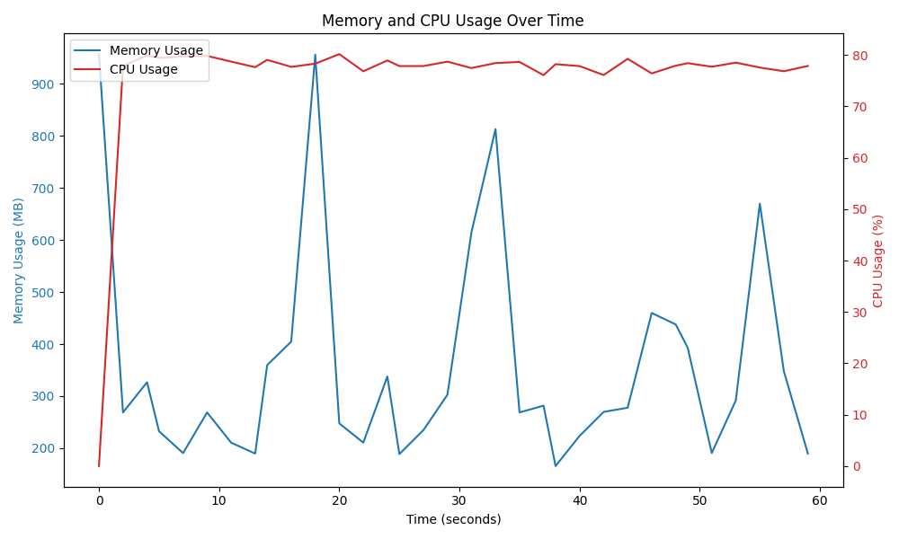

## spring-reactive_file_read
```
Running 1m test @ http://localhost:8080/api/benchmark/file-system-read
  12 threads and 100 connections
  Thread Stats   Avg      Stdev     Max   +/- Stdev
    Latency    53.24ms   55.79ms 444.74ms   84.49%
    Req/Sec   103.79     88.75   580.00     90.16%
  54745 requests in 1.00m, 4.07MB read
Requests/sec:    911.73
Transfer/sec:     69.45KB
```

## spring-mvc-virtual-threads_file_read
```
Running 1m test @ http://localhost:8081/api/benchmark/file-system-read
  12 threads and 100 connections
  Thread Stats   Avg      Stdev     Max   +/- Stdev
    Latency   105.18ms   39.57ms 385.43ms   70.25%
    Req/Sec    76.38     17.84   141.00     75.49%
  54868 requests in 1.00m, 6.92MB read
Requests/sec:    913.44
Transfer/sec:    117.90KB
```

## spring-mvc_file_read
```
Running 1m test @ http://localhost:8082/api/benchmark/file-system-read
  12 threads and 100 connections
  Thread Stats   Avg      Stdev     Max   +/- Stdev
    Latency   104.49ms   45.44ms 530.82ms   69.77%
    Req/Sec    77.04     21.83   180.00     65.69%
  55336 requests in 1.00m, 6.98MB read
Requests/sec:    921.17
Transfer/sec:    118.90KB
```

## quarkus-reactive_file_read
```
Running 1m test @ http://localhost:8083/api/benchmark/file-system-read
  12 threads and 100 connections
  Thread Stats   Avg      Stdev     Max   +/- Stdev
    Latency   174.46ms   26.12ms 348.28ms   68.54%
    Req/Sec    45.89     14.46    80.00     68.39%
  33004 requests in 1.00m, 2.71MB read
Requests/sec:    549.25
Transfer/sec:     46.13KB
```

